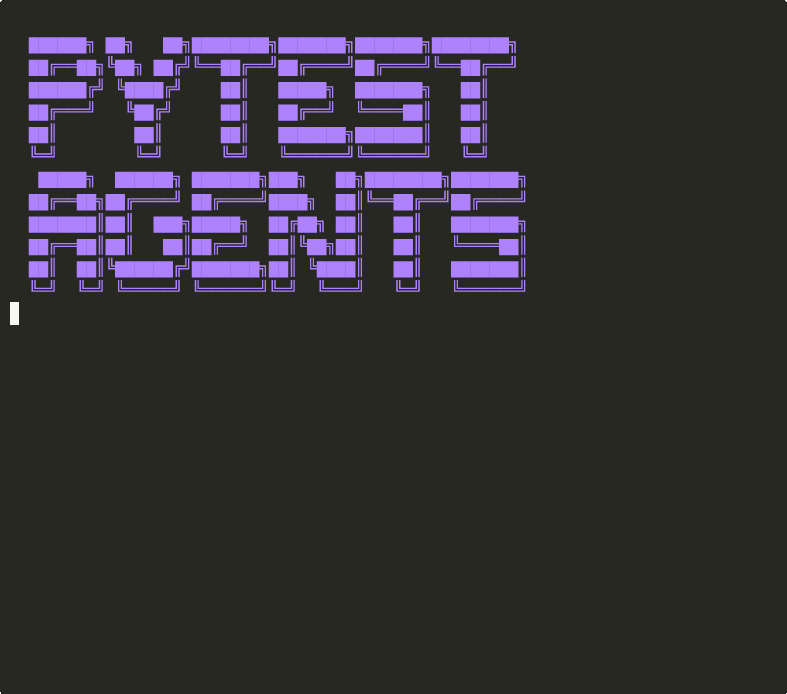

# pytest-agents

[](https://pypi.org/project/pytest-agents/)
[](https://pypi.org/project/pytest-agents/)
[](https://opensource.org/licenses/MIT)
[](https://github.com/naveenkumarbaskaran/pytest-agents/actions)

**Pytest plugin for testing AI agents** — mock LLMs, assert tool calls, track token usage, and regression-test prompt changes.

```
pip install pytest-agents
```

## 🎬 Demo

<p align="center">
  
  <br>
  <em>Running agent tests: mock LLM responses, assert tool call sequences, catch prompt regressions</em>
</p>

---

## Why?

Every team building AI agents needs testing, but there's no standard way to:
- **Mock LLM responses** deterministically (record/replay)
- **Assert tool call sequences** ("did the agent call search before summarize?")
- **Track token costs** per test ("this test costs $0.03")
- **Regression-test prompts** ("did this prompt change break behavior?")
- **Set budgets** ("fail if any test exceeds 5000 tokens")

pytest-agents solves all of these as a pytest plugin. Works with **any framework** — LangChain, CrewAI, OpenAI, Anthropic, LiteLLM, or raw HTTP.

## Quick Start

### 1. Mock LLM responses

```python
from pytest_agents import mock_llm, LLMResponse

def test_agent_greeting(mock_llm):
    """Mock returns deterministic responses."""
    mock_llm.add_response(LLMResponse(
        content="Hello! How can I help you today?",
        model="gpt-4o",
        tokens={"prompt": 10, "completion": 8},
    ))

    # Your agent code calls the LLM...
    result = my_agent.run("Hi there")

    assert "help" in result.lower()
    assert mock_llm.call_count == 1
```

### 2. Assert tool call sequences

```python
from pytest_agents import AgentTracer

def test_agent_uses_correct_tools():
    """Verify the agent calls tools in the expected order."""
    tracer = AgentTracer()

    with tracer.trace():
        result = my_agent.run("What's the weather in Berlin?")

    tracer.assert_tools_called(["geocode", "weather_api"])
    tracer.assert_tool_called_with("geocode", city="Berlin")
    assert tracer.tool_count == 2
```

### 3. Track token costs

```python
import pytest

@pytest.mark.max_tokens(5000)
def test_agent_is_efficient():
    """Fail if the agent uses more than 5000 tokens."""
    result = my_agent.run("Summarize this document")
    assert result is not None

@pytest.mark.max_cost_usd(0.05)
def test_agent_cost_budget():
    """Fail if this test costs more than $0.05."""
    result = my_agent.run("Complex analysis task")
    assert "analysis" in result.lower()
```

### 4. Record and replay LLM calls

```python
from pytest_agents import record_llm, replay_llm

# First run: records real LLM responses to fixtures/
@record_llm("fixtures/greeting_test.json")
def test_greeting_record():
    result = my_agent.run("Hello")
    assert "hello" in result.lower()

# Subsequent runs: replays from fixtures (no API calls, free, fast)
@replay_llm("fixtures/greeting_test.json")
def test_greeting_replay():
    result = my_agent.run("Hello")
    assert "hello" in result.lower()
```

### 5. Regression-test prompt changes

```python
from pytest_agents import prompt_snapshot

@prompt_snapshot("agent_system_prompt")
def test_system_prompt_unchanged():
    """Fails if the system prompt changed since last snapshot."""
    return my_agent.system_prompt

# Run with --snapshot-update to accept new prompt versions
# pytest --snapshot-update
```

## Fixtures

| Fixture | Description |
|---------|-------------|
| `mock_llm` | Pre-configured LLM mock with response queue |
| `agent_tracer` | Tool call tracer (auto-starts/stops per test) |
| `token_tracker` | Token usage tracker for the current test |
| `llm_cassette` | VCR-style record/replay for LLM calls |

## Markers

| Marker | Description |
|--------|-------------|
| `@pytest.mark.agent` | Tag a test as an agent test (for filtering) |
| `@pytest.mark.max_tokens(n)` | Fail if test exceeds n tokens |
| `@pytest.mark.max_cost_usd(n)` | Fail if test exceeds $n |
| `@pytest.mark.slow_agent` | Mark slow agent tests (skip with `-m "not slow_agent"`) |

## CLI Options

```bash
pytest --agent-report          # Print token/cost summary after test run
pytest --snapshot-update       # Update prompt snapshots
pytest -m agent                # Run only agent tests
pytest -m "not slow_agent"     # Skip slow agent tests
```

## Architecture

```
pytest-agents/
├── plugin.py          # Pytest plugin entry point (hooks + fixtures)
├── mock_llm.py        # LLM mock with response queue
├── tracer.py          # Tool call tracing and assertions
├── tokens.py          # Token counting and cost tracking
├── recorder.py        # Record/replay LLM calls (cassette)
├── snapshot.py        # Prompt snapshot regression testing
└── markers.py         # Custom pytest markers
```

## Framework Compatibility

| Framework | Support | Notes |
|-----------|---------|-------|
| OpenAI SDK | ✅ | Patches `openai.ChatCompletion.create` |
| Anthropic SDK | ✅ | Patches `anthropic.Anthropic.messages.create` |
| LiteLLM | ✅ | Patches `litellm.completion` |
| LangChain | ✅ | Works via LLM patches |
| Raw HTTP | ✅ | Use `mock_llm` fixture directly |

## Contributing

```bash
git clone https://github.com/naveenkumarbaskaran/pytest-agents.git
cd pytest-agents
python -m venv .venv && source .venv/bin/activate
pip install -e ".[dev]"
pytest
```

## License

MIT
